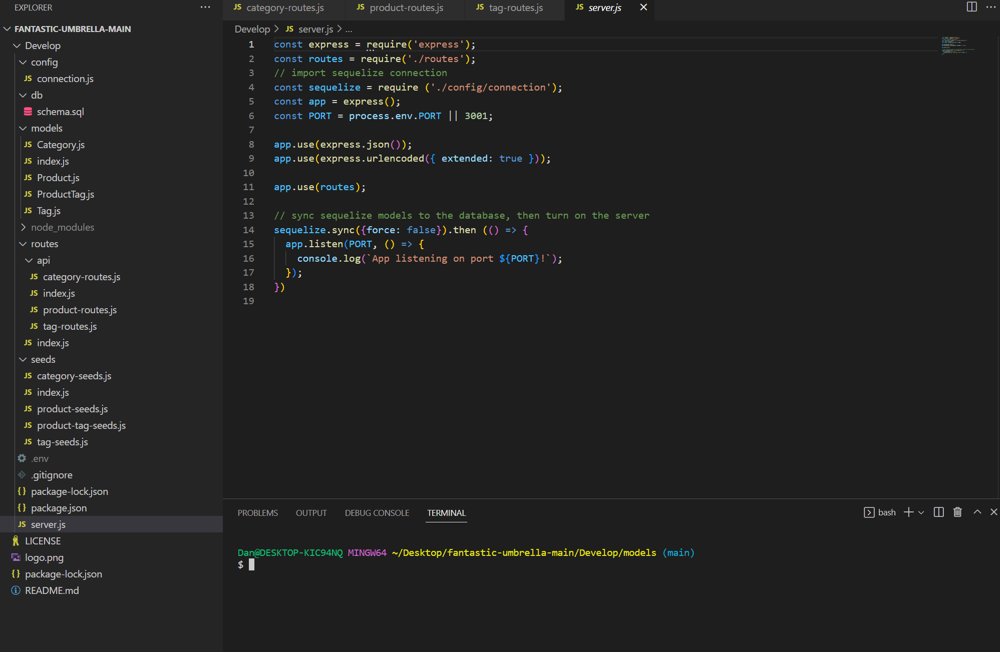

# employee-tracker

[![Contributors][contributors-shield]][contributors-url]
[![Forks][forks-shield]][forks-url]
[![Stargazers][stars-shield]][stars-url]
[![Issues][issues-shield]][issues-url]
[![MIT License][license-shield]][license-url]

<!-- PROJECT LOGO -->
 

    

  <h3 align="center">eCommerce Back End README</h3>

  

    Welcome to the eCommerce Back End README, a great spot to get to know this project!
     
    <a href="https://github.com/danpoggetti/e-commerce-back-end"><strong>Explore the docs »</strong></a>
     
     
    <a href="https://danpoggetti.github.io/e-commerce-back-end/">View Demo</a>
    ·
    <a href="https://github.com/danpoggetti/e-commerce-back-end/issues">Report Bug</a>
    ·
    <a href="https://github.com/danpoggetti/e-commerce-back-end/issues">Request Feature</a>
  

<!-- TABLE OF CONTENTS -->

  
Table of Contents

  <ol>
    <li>
      <a href="#about-the-project">About The Project</a>
      <ul>
        <li><a href="#built-with">Built With</a></li>
      </ul>
    </li>
    <li><a href="#getting-started">Getting Started</a></li>
    <li><a href="#usage">Usage</a></li>
    <li><a href="#roadmap">Roadmap</a></li>
    <li><a href="#contributing">Contributing</a></li>
    <li><a href="#license">License</a></li>
    <li><a href="#contact">Contact</a></li>
    <li><a href="#acknowledgments">Acknowledgments</a></li>
  </ol>

<!-- ABOUT THE PROJECT -->
## About The Project

AS A manager at an internet retail company
I WANT a back end for my e-commerce website that uses the latest technologies
SO THAT my company can compete with other e-commerce companies

(<a href="#readme-top">back to top</a>)

### Built With

Below are the following technologies and applications utilized to help build the project. 

VS Code 
JavaScript 
Node 
MySQL2 
Inquirer 
Insomnia 

(<a href="#readme-top">back to top</a>)

<!-- GETTING STARTED -->
## Getting Started

Below you'll be able to see screen shots of the deployed app. You can also view the road map to see how you can test it locally.

(<a href="#readme-top">back to top</a>)

<!-- USAGE EXAMPLES -->
## Usage

Here's a video tutorial on how to use the app: 
<a href="">View Tutorial</a>  

Here's a screen shot of what the app looks like when someone starts it.

(<a href="#readme-top">back to top</a>)

<!-- ROADMAP -->
## Roadmap

GIVEN a functional Express.js API
WHEN I add my database name, MySQL username, and MySQL password to an environment variable file
THEN I am able to connect to a database using Sequelize
WHEN I enter schema and seed commands
THEN a development database is created and is seeded with test data
WHEN I enter the command to invoke the application
THEN my server is started and the Sequelize models are synced to the MySQL database
WHEN I open API GET routes in Insomnia for categories, products, or tags
THEN the data for each of these routes is displayed in a formatted JSON
WHEN I test API POST, PUT, and DELETE routes in Insomnia
THEN I am able to successfully create, update, and delete data in my database

See the [open issues](https://github.com/danpoggetti/e-commerce-back-end/issues) for a full list of proposed features (and known issues).

(<a href="#readme-top">back to top</a>)

<!-- CONTRIBUTING -->
## Contributing

I strongly feel that contributing well throught and engaging suggestions are instrumental. I am an avid learner and want to let you know any contribution or suggestions are apprecaited.

If you truly believe you can contribute to making this website better, please fork the repo and create a pull request. If you do not wish to fork, you can open and create an issue with the tag "enhancement" or "suggestions". I will then be able to review it and take it into consideration. Lastly, please don't forget to give the project a star!

1. Fork the Project
2. Create your Feature Branch (`git checkout -b feature/newSuggestion`)
3. Commit your Changes (`git commit -m 'Add some NewSuggestion'`)
4. Push to the Branch (`git push origin feature/NewSuggestion`)
5. Open a Pull Request

(<a href="#readme-top">back to top</a>)

<!-- LICENSE -->
## License

Distributed under the MIT License. 
Copyright (c) 2022 Dan Poggetti 
See License.text for more information.

(<a href="#readme-top">back to top</a>)

<!-- CONTACT -->
## Contact

Dan Poggetti - GitHub [https://github.com/danpoggetti]

Project Link: [https://github.com/danpoggetti/e-commerce-back-end]

Demo Link: [https://danpoggetti.github.io/e-commerce-back-end/]

(<a href="#readme-top">back to top</a>)

<!-- ACKNOWLEDGMENTS -->
## Acknowledgments

I want to acknowledge the many great and vast resouces that adided us in creating this weather dashboard app.

* [Google](https://www.google.com)
* [YouTube](https://www.youtube.com)
* [GitHub Pages](https://pages.github.com)
* Jacob Carber
* [README Template courtesy of othneildrew](https://github.com/othneildrew/Best-README-Template)
* [MIT License text](https://mit-license.org/license.txt)
* [Shields.io for badges](https://shields.io/)

(<a href="#readme-top">back to top</a>)

<!-- MARKDOWN LINKS & IMAGES -->
<!-- https://www.markdownguide.org/basic-syntax/#reference-style-links -->
[contributors-shield]: https://img.shields.io/github/contributors-anon/danpoggetti/e-commerce-back-end?style=for-the-badge
[contributors-url]: https://github.com/danpoggetti/e-commerce-back-end/graphs/contributors
[forks-shield]: https://img.shields.io/github/forks/danpoggetti/e-commerce-back-end?style=for-the-badge
[forks-url]: https://github.com/danpoggetti/e-commerce-back-end/network/members
[stars-shield]: https://img.shields.io/github/stars/danpoggetti/e-commerce-back-end?style=for-the-badge
[stars-url]: https://github.com/danpoggetti/e-commerce-back-end/stargazers
[issues-shield]: https://img.shields.io/github/issues/danpoggetti/e-commerce-back-end?style=for-the-badge
[issues-url]: https://github.com/danpoggetti/e-commerce-back-end/issues
[license-shield]: https://img.shields.io/github/license/danpoggetti/e-commerce-back-end?style=for-the-badge
[license-url]: https://github.com/danpoggetti/e-commerce-back-end/blob/main/LICENSE
[product-screenshot]: images/screenshot.png
